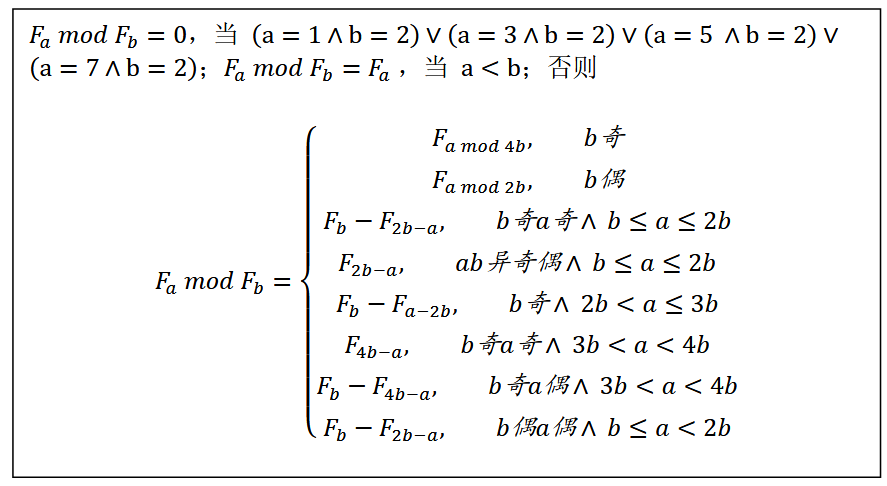

# Fast computation of modular reduction between two Fibonacci numbers (Fa mod Fb) 

## Background and Method

For the problem of computing $F_a \bmod F_b$, existing methods typically first compute $F_b$ using fast doubling or matrix exponentiation, and then compute $F_a$ while applying modular reduction by $F_b$ at each step. This approach has a theoretical time complexity of $O(\log n)$.

Alternatively, other methods apply the Fibonacci addition formula $F_{m+n} = F_{m+1}F_n + F_mF_{n-1}$ and the divisibility property $a \mid b \Rightarrow F_a \mid F_b$, which further reduces the problem size.

However, for 64-bit computers, the maximum value of an unsigned integer is $2^{64} \approx 1.8 \times 10^{19}$. If an arithmetic operation exceeds this limit, it cannot be handled directly by the hardware arithmetic logic unit (ALU) and must be implemented using software-based big integer arithmetic.

In big integer arithmetic, addition and subtraction require digit-wise traversal, resulting in a time complexity of $O(k)$, where $k$ is the number of digits. Multiplication and division (including modulo operations) require nested digit-wise traversal, leading to a time complexity of $O(k^2)$.

The Fibonacci sequence grows very rapidly. Starting from $n \geq 94$, $F_n$ already exceeds the 64-bit unsigned integer limit. Therefore, when considering software-level big integer computation, a naive approach to computing $F_a \bmod F_b$ will inevitably incur the overhead of large-number arithmetic.

Here, we propose a fast computation method derived from Fibonacci identities and index transformation techniques.



See more details in my essay: [斐波那契数列各项间模运算速算方法.pdf](./assets/斐波那契数列各项间模运算速算方法.pdf)

## Quick Start

If you want to use the above method to solve the $F_a \bmod F_b$ problem, please follow these steps:

```bash
pip install gmpy2
```
Then copy the file fib_mod_fast.py into your directory, and import it using:
```python
from fib_mod_fast import fun
```
The function `fun` takes two positional arguments, which are the indices of the two Fibonacci numbers used for the modular operation. It returns the result of $F_a \bmod F_b$. All inputs and outputs are of type `gmpy2.mpz`.

There is an example below:
```python
from fib_mod_fast import fun
from gmpy2 import mpz

a = mpz(1000)
b = mpz(500)

# compute F_a mod F_b
result = fun(a, b)
```
## Verify correctness using brute-force approach

We already have a rigorous mathematical proof. However, if you prefer to use a computational method to verify this via brute force, we have provided such a method.

Please navigate to the directory `check_true` and follow these steps:

```bash
pip install gmpy2 tqdm
python setup.py lib.pyx
python main.py 1e5
# Suppose you wish to perform an exhaustive search on data in the range of 0 to 100000.
```

