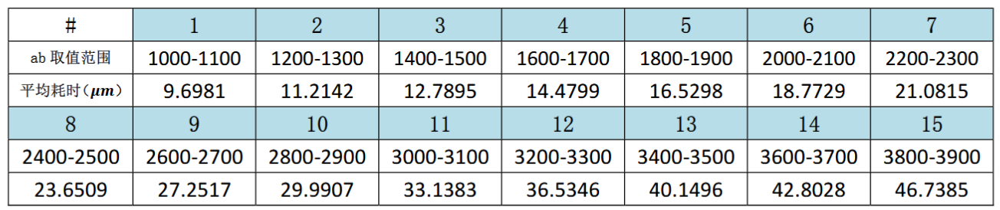
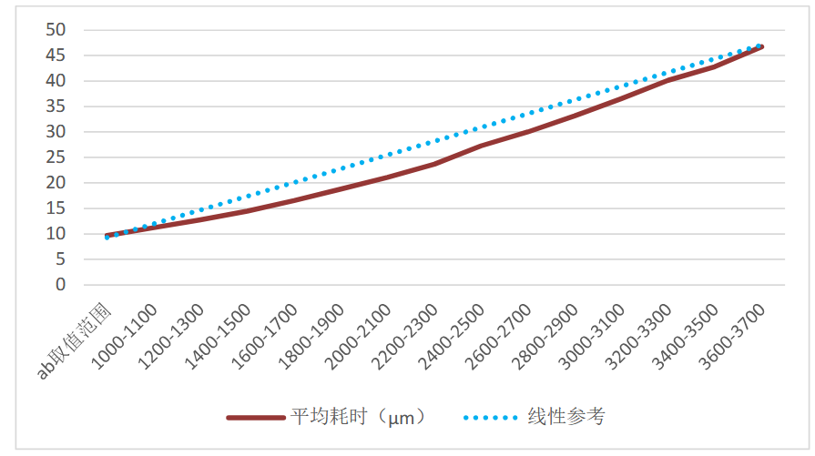
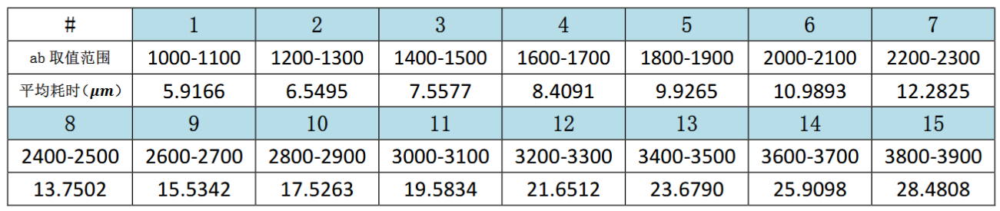
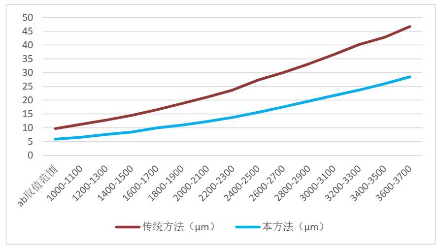

# 斐波那契数列各项间模运算速算方法

------基于计算机算法优化的实验探究

本文介绍了一种斐波那契数列各项间模运算（即
$F_{a}\ mod\ F_{b}$）的速算方法。现有方法依赖于先用快速翻倍法计算出
$F_{b}$ 的值再用 $F_{a}$
对其进行取模，牵扯到大数乘除运算，计算机执行效率较低。本文利用数论知识，对数据的范围及奇偶性进行分类，将原问题转化为大数加减法运算，提高了运算效率。

"斐波那契数列"由意大利数学家莱昂纳多·斐波那契在1202年提出，起初用以解决兔子的繁殖问题，后因其简洁的递推结构、丰富的数论性质，成为数论、组合数学、代数等领域的经典研究对象。

斐波那契数列通常记为 $\left. ｛F_{n} \right.｝$,初始条件
$F_{0} = 0$,$\ F_{1} = 1$,递推关系$F_{n} = F_{n - 1} + F_{n - 2}$.
斐波那契数列取模运算的研究最早可追溯至 18 世纪，1774
年，拉格朗日（Joseph Louis Lagrange）首次注意到斐波那契数列模 10
的剩余序列具有周期性。如今，斐波那契数列取模运算的规律被广泛应用于密码学、素性测试等领域。

现有研究大多关注 $F_{a}\ mod\ x$,（其中 x
为任意整数）的计算问题，本文则另辟新径，研究斐波那契数列各项间模运算,即
$F_{a}\ mod\ F_{b}$ (a,b ∈ N) 的速算方法。

## 一、现有计算方法

面对计算 $F_{a}\ mod\ F_{b}$
任务，根据现有办法，可先用快速翻倍法（或矩阵快速幂法）计算出 $F_{b}$
的值，然后再用快速翻倍法计算 $F_{a}\ $，并在每次计算中取模 $F_{b}$.
理论时间复杂度为
$O\ \left( \log n \right)$.也可以根据斐波那契数列加法公式
$F_{m + n} = F_{m + 1}F_{n} + F_{m}F_{n - 1}$ 和整除性质
$a|b\overset{\ }{\Rightarrow}F_{a}|F_{b}$，设 $a = qb + r$，则
$F_{a}\  \equiv {F_{(b - 1)}}^{q}\ F_{r\ }\ (mod\ F_{b})\ $，将数据规模进一步缩小。

然而，考虑到斐波那契数列的增长速度，在实际计算时，$O\ \left( \log n \right)$
的理论时间复杂度不能正确反映计算效率。对于64位计算机，无符号整数上限为
$2^{64} \approx 1.8 \times 10^{19}$，如果对一个大于这个上限的数字进行运算，无法从算术逻辑单元（ALU）硬件层面完成，必须在软件上进行大数操作。在C中，没有原生的大数操作的函数，必须手动编写模拟竖式进行运算，加减法需要遍历较长数的每一位，乘除法（取模）需要分别嵌套遍历两个数字的每一位。设数据位数为
$k$ 、对每一位数字的计算为
$O(1)$，则对大数进行加法（减法）时，时间复杂度为 $O(k)$,
对大数进行乘除法（取模）时，时间复杂度为 $O(k^{2})$.
斐波那契数列增长速度很快，自 $n \geq 94$ 起，$\ F_{n}$
就超过64位无符号整数上限. 根据通项公式
$F_{n} = \frac{1}{\sqrt{5}}\left\lbrack \left( \frac{1 + \sqrt{5}}{2} \right)^{n} - \left( \frac{1 - \sqrt{5}}{2} \right)^{n} \right\rbrack$
,对其取10的对数，
${\log_{10}F}_{n} = n\log_{10}\varphi - \frac{1}{2}\log_{10}5$ ,（其中
$\log_{10}\varphi$ 是非负的常数），可见斐波那契数列
$\left. ｛F_{n} \right.｝$ 的位数与 $n$
成正比，故而，考虑到软件层面的大数运算，如果使用传统方法计算
$F_{a}\ mod\ F_{b}$，计算效率必然受到大数操作的影响。具体来说，设大数操作层面每一次操作为
$O\ (1)$，且快速翻倍法中每次迭代（或递归）也为
$O\ (1)$，则当我们先用快速翻倍法（或矩阵快速幂法）计算出 $F_{b}$
的值，然后再用快速翻倍法计算 $F_{a}\ $，并在每次计算中取模 $F_{b}$
时，最终时间复杂度为 迭代（或递归）次数 $O\ (\log n)$ × (每次取模复杂度
$O(n^{2})$ + 每次按公式大数乘法计算复杂度 $O(n^{2})$ ), 即
$O(n^{2}\log n)$；如果利用上文提到的同余式缩小数据规模再计算，则会牵扯进大数的幂运算，更加降低了效率，反而得不偿失。

不同于C，Python具有原生的大数操作的能力，且使用了很多优化算法。例如，Python会将大数分割为若干个digit
块分别计算，且针对数据大小自动使用Karatsuba、FFT等算法，最理想情况下可以将大数乘除的时间复杂度压缩至$O(n\log n)$.
上表所示是笔者使用Python，对指定范围的 $a,b$ 使用传统方法计算
$F_{a}\ mod\ F_{b}$，借助time函数统计每次运算平均消耗的时间（时间单位为$\mu m$，每次计算重复30次取平均值，耗时是指对于每个a、b计算
$F_{a}\ mod\ F_{b}$ 消耗的时间）

从图中可以看出，其增长快于线性。我们假设大数乘除的时间复杂度为理论下限
$O(n\log n)$，考虑快速翻倍法求每个 $F_{a}$、$F_{b}$
的时间消耗（$O(\log n)$），则传统方法计算 $F_{a}\ mod\ F_{b}$
的时间复杂度为$O(n\log n\log n)$.

绘图如下：

## 二、本文介绍的速算方法

是否有更好的方法计算
$F_{a}\ mod\ F_{b}$？在实践过程中，笔者发现、总结、并证明了下面这个高效的闭式算法。

根据此，我们可以把两个斐波那契数列中的数字的取模运算（$F_{a}\ mod\ F_{b}$）转化为加减法运算。对
$F_{n}$ 进行加减法运算的时间复杂度理论下限为
$O(n)$（设对每一位数字的计算为
$O(1)$），考虑快速翻倍法的时间消耗（$O(\log n)$），则本方法计算
$F_{a}\ mod\ F_{b}$
的时间复杂度为$O({nlog}n)$.当然，如果考虑快速翻倍法中的大数乘法，这个表述可能不太准确。

作者同样使用Python，对指定范围的 $a,b$ 使用本方法计算
$F_{a}\ mod\ F_{b}$，借助time函数统计每次运算平均消耗的时间（时间单位为$\mu m$，每次计算重复30次取平均值，耗时是指对于每个a、b计算
$F_{a}\ mod\ F_{b}$
消耗的时间）从图中可以看出，其效率优于传统方法。面对更大的数据规模，优势可能更加明显。在特定的使用场景中，我们有机会预计算出足够使用的斐波那契数列的数值存储在内存中，不必每次计算都进行一次快速翻倍法，这种情况下，本方法的效率可能远远优于强行取模。

绘图如下：

## 三、数学证明

下面所有同余式都是对 $mod\ F_{b}$ 而言。

加法定理：$F_{m + n} = F_{m + 1}F_{n} + F_{m}F_{n - 1}\overset{}{\Rightarrow}\ F_{n + b} \equiv F_{n}F_{b \pm 1}\ $，①；

Cassini恒等式：$F_{n + 1}F_{n - 1} - {F_{n}}^{2} = {( - 1)}^{n}\overset{}{\Rightarrow}\ F_{b \pm 1} \equiv {( - 1)}^{b}\ $，②；

减法定理：$F_{m - n} = {( - 1)}^{n}{(F}_{m}F_{n + 1} - F_{m + 1}F_{n})\overset{}{\Rightarrow}\ F_{b - n} \equiv {( - 1)}^{n + 1}F_{b + 1}F_{n}\ $，③；

**1.证明**
$\mathbf{F}_{\mathbf{a}}\mathbf{\ mod\ }\mathbf{F}_{\mathbf{b}}\mathbf{=}\left\{ \begin{array}{r}
\mathbf{F}_{\mathbf{a\ mod\ 4b}}\mathbf{,\ \ b}\mathbf{奇} \\
\mathbf{F}_{\mathbf{a\ mod\ 2b}}\mathbf{,\ \ b}\mathbf{偶}
\end{array} \right.\ $

由①得，$F_{a + 2b} = F_{(a + b) + b} \equiv F_{a + b}F_{b - 1}$,
对于其中的 $F_{a + b}$, $F_{a + b} \equiv F_{a}F_{b - 1}$, 所以
$F_{a + 2b} \equiv {F_{b - 1}}^{2}F_{a}$,
由②得，$F_{a + 2b} \equiv {( - 1)}^{b}F_{a}$.

$b$偶，$F_{a + 2b} \equiv F_{a}$, 则命题显然可证得。

$b$奇，$F_{a + 2b} \equiv {- F}_{a}$, 再用一次上式，得
$F_{a + 4b} = F_{(a + 2b) + 2b} \equiv - F_{a + 2b} \equiv - \left( - F_{a} \right)$,
即 $F_{a + 4b} \equiv F_{a}$, 则命题显然可证得。

**2.证明**
$\mathbf{F}_{\mathbf{a}}\mathbf{\ mod\ }\mathbf{F}_{\mathbf{b}}\mathbf{=}\left\{ \begin{array}{r}
\begin{array}{r}
\mathbf{F}_{\mathbf{b}}\mathbf{-}\mathbf{F}_{\mathbf{2b - a}}\mathbf{,\ \ b}\mathbf{奇}\mathbf{a}\mathbf{奇}\mathbf{\land \ b \leq a \leq 2}\mathbf{b}
\end{array} \\
\mathbf{F}_{\mathbf{b}}\mathbf{-}\mathbf{F}_{\mathbf{2b - a}}\mathbf{,\ \ b}\mathbf{偶}\mathbf{a}\mathbf{偶}\mathbf{\land \ b \leq a < 2}\mathbf{b} \\
\mathbf{F}_{\mathbf{2b - a}}\mathbf{,\ \ ab}\mathbf{异奇偶}\mathbf{\land \ b \leq a \leq 2}\mathbf{b}
\end{array} \right.\ $

设 $t = 2b - a$, 则 $a = 2b - t$.
由①得，$F_{2b - t} = F_{b + (b - t)} \equiv F_{b - t}F_{b + 1}$,
由③得，对于其中的 $F_{b - t}$,
$F_{b - t} \equiv {( - 1)}^{t + 1}F_{b + 1}F_{t}$, 所以
$F_{2b - t} \equiv {( - 1)}^{t + 1}{F_{b + 1}}^{2}F_{t}$,
由②得，$F_{2b - t} \equiv ( - 1)^{t + 1}( - 1)^{b}F_{t} = ( - 1)^{3b - a + 1}F_{t}$.

$ab$同奇偶, $F_{2b - t} \equiv - F_{t}$, $F_{a} \equiv - F_{2b - a}$,
则命题显然可证得。

$ab$异奇偶, $F_{2b - t} \equiv F_{t}$, $F_{a} \equiv F_{2b - a}$,
则命题显然可证得。

**3.证明**
$\mathbf{F}_{\mathbf{a}}\mathbf{\ mod\ }\mathbf{F}_{\mathbf{b}}\mathbf{= \ }\mathbf{F}_{\mathbf{b}}\mathbf{-}\mathbf{F}_{\mathbf{a - 2b}}\mathbf{,\ \ b奇 \land \ 2b < a \leq 3b}$

设 $t = a - 2b$, 则 $a = 2b + t$.
由①得，$F_{2b + t} = F_{b + (b + t)} \equiv F_{b + t}F_{b + 1}$,对于其中的
$F_{b + t}$, $F_{b + t} \equiv F_{b + 1}F_{t}$, 所以
$F_{2b + t} \equiv {F_{b + 1}}^{2}F_{t}$,
由②得，$F_{2b + t} \equiv {( - 1)}^{b}F_{t}$, 即
$F_{2b + t} \equiv - F_{t}$, 即 $F_{a} \equiv - F_{a - 2b}$,
则命题显然可证得。

**4.证明**
$\mathbf{F}_{\mathbf{a}}\mathbf{\ mod\ }\mathbf{F}_{\mathbf{b}}\mathbf{=}\left\{ \begin{array}{r}
\begin{array}{r}
\mathbf{F}_{\mathbf{4b - a}}\mathbf{,\ \ b}\mathbf{奇}\mathbf{a}\mathbf{奇}\mathbf{\land \ 3}\mathbf{b < a < 4}\mathbf{b}
\end{array} \\
\mathbf{F}_{\mathbf{b}}\mathbf{-}\mathbf{F}_{\mathbf{4b - a}}\mathbf{,\ \ b}\mathbf{奇}\mathbf{a}\mathbf{偶}\mathbf{\land \ 3}\mathbf{b < a < 4}\mathbf{b}
\end{array} \right.\ $

设 $t = 4b - a$, 则
$a = 4b - t$.同**2.**之理，可以得到$F_{4b - t} \equiv ( - 1)^{4b - a + 1}F_{t}$.

$a\ $奇 $b\ $奇, $F_{4b - t} \equiv F_{t}$, $F_{a} \equiv F_{4b - a}$,
则命题显然可证得。

$a\ $偶 $b\ $奇, $F_{4b - t} \equiv {- F}_{t}$,
$F_{a} \equiv - F_{4b - a}$, 则命题显然可证得。

## 四、总结

本文发现了提高斐波那契数列中较大数互相取模（$F_{a}\ mod\ F_{b}$）运算效率的方法，主要运用了数学知识。
